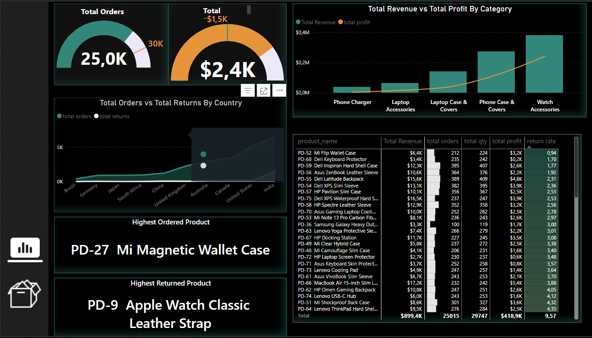

# Power BI Dashboard for a Case Company
## Dashboard Previews

### Dark Version Dashboard

### Product Analysis

### White Version Dashboard

# **Interactive Analytics Dashboard for CASE Company**

## **Objective**  
The goal of this project was to develop an interactive and user-friendly analytics dashboard for **CASE Company**, a business specializing in mobile phone accessories. The dashboard provides comprehensive insights into sales, profitability, product performance, and returns while tackling key data challenges such as integrating multiple data sources and standardizing currency conversions.  

---

## **Project Overview**  

### **Key Features**  
- **Multi-Source Data Integration:** Combined data from **PostgreSQL, MySQL, Excel, CSV, and PDF** for a holistic analysis.  
- **Currency Standardization:** Converted global sales into **USD** to ensure uniform financial reporting.  
- **Profitability Analysis:** Incorporated **cost of goods sold (COGS), discounts, and quantities** to refine financial metrics.  
- **Interactive Dashboard:** Implemented **slicers, custom panes, and drillthrough buttons** for an engaging analytical experience.  
- **Automated Data Refresh:** Configured **Power BI Gateway** for seamless updates.  
- **Advanced DAX Metrics:** Developed KPIs such as **revenue, profit margin, and year-over-year (YoY) sales growth**.  
- **Data Security:** Implemented **Row-Level Security (RLS)** to control user access based on roles.  

---

## **Technology Stack**  

- **Data Sources:** PostgreSQL, MySQL, Excel, CSV, PDF  
- **Tools:** Power BI, Power Query, DAX  
- **Gateway:** Power BI Gateway for scheduled data refresh  

---

## **Step-by-Step Execution**  

### **1. Data Integration**  
- Established connections with multiple data sources:  
  - **PostgreSQL** (cloud-hosted sales data)  
  - **MySQL** (local warehouse management system)  
  - **Excel, CSV, and PDF** (supplementary data such as currency exchange rates)  
- Utilized **Power Query** for **data cleaning, transformation, and merging** to create a unified dataset.  

### **2. Data Standardization**  
- **Currency Conversion:** Converted all financial data into **USD** using provided exchange rates for accurate cross-country comparisons.  
- **Metric Normalization:** Standardized **units and formats** across datasets to ensure consistency in reporting.  

### **3. Data Modeling**  
- Designed a **star schema** to efficiently structure data relationships.  
- Merged **COGS and product datasets** to enhance profitability calculations.  
- Incorporated **discount percentages and quantities** to refine sales metrics.  

### **4. Dashboard Design**  
- Developed an **interactive multi-page dashboard** featuring:  
  - **Light/Dark Mode** toggles for user customization.  
  - **Navigation Pages**: Sales overview, product performance, and return insights.  
  - **Visual Elements**: Donut charts, bar charts, geo maps, radar charts, slicers, and matrix tables.  
  - **Drillthrough Buttons**: Enabled deeper analysis into top-selling products and return trends.  
  - **Custom Slicer Panes**: Improved interactivity and dynamic filtering.  

### **5. Advanced Calculations**  
- Created **custom DAX measures** to enhance analytics:  
  - **Revenue, profit, and profit margin calculations**  
  - **Sales targets based on last month's performance**  
  - **YoY growth and overall sales trend analysis**  

### **6. Automation & Security**  
- **Scheduled Data Refresh**: Integrated **Power BI Gateway** for automatic updates as new data streams in.  
- **Row-Level Security (RLS)**: Implemented access controls to ensure users only view data relevant to their roles.  

# Final Output
## Screenshots

